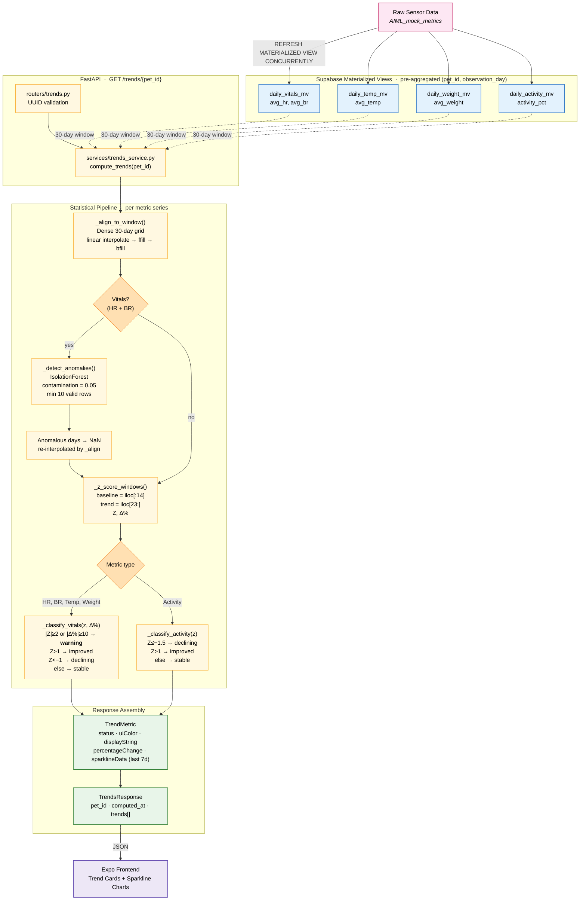

# PetPulse Trends Engine

End-to-end technical reference for how PetPulse derives 30-day, Apple-Health-style trend insights for each pet. The pipeline is a deterministic analytics design: pre-aggregated Supabase materialized views feed a pandas-based statistical pipeline that applies anomaly masking (IsolationForest) and windowed Z-score classification, then returns a structured payload the Expo frontend renders directly as colored trend cards and sparklines.

---

## 1. Architectural Overview



The request boundary is a single FastAPI route (`GET /trends/{pet_id}`) defined in `routers/trends.py`, which delegates to `services/trends_service.compute_trends()`. No LLM is called on the request path.

---

## 2. Data Aggregation Layer — Supabase Materialized Views

The Trends Engine **never reads raw sensor rows**. All heavy aggregation is pushed into Postgres via four materialized views pre-keyed on `(pet_id, observation_day)`. Each API call issues one bounded `SELECT` per MV with a 30-day date range.

| Materialized View | Columns Read | Source Signal | Role in Pipeline |
|---|---|---|---|
| `daily_vitals_mv` | `observation_day`, `avg_hr`, `avg_br` | Heart rate + breathing rate (JSONB `data.heartRate` / `data.breathRate`) | Primary vitals; fed through IsolationForest |
| `daily_temp_mv` | `observation_day`, `avg_temp` | Environmental temperature (JSONB `data.temperature`) | Daily mean body/env temperature |
| `daily_weight_mv` | `observation_day`, `avg_weight` | Weight readings | Daily mean weight |
| `daily_activity_mv` | `observation_day`, `activity_pct` | Activity classifier (JSONB `data.classifier.activityClass`) | Percent-of-day active |

**No RPC functions are used.** Unlike the AI Summary pipeline (which uses `get_baseline_vitals` / `get_baseline_activity`), the Trends Engine computes baselines entirely in Python from the raw MV rows. This keeps the 30-day window, the anomaly mask, and the baseline/trend split co-located in one service, so the statistical logic is auditable without jumping between Postgres and Python.

**Query shape (identical across all four fetchers):**

```
SELECT <cols>
FROM <mv>
WHERE pet_id = :pet_id
  AND observation_day BETWEEN :start AND :end
ORDER BY observation_day
```

- Window is always `[today - 29 days, today]` → at most 30 rows per metric.
- All four fetches are independent; the service executes them sequentially via the synchronous `supabase-py` client.
- Missing rows are tolerated — each fetcher returns an empty typed `DataFrame` rather than raising, so a metric without data is simply skipped downstream.

**MV refresh cadence is owned outside this service** (manual `REFRESH MATERIALIZED VIEW CONCURRENTLY <name>` via the Supabase SQL Editor). The API response therefore reflects the last refresh, not real-time ingest.

---

## 3. Statistical Logic — Baseline vs. Trend Windowing

Improvement and decline are **not** computed as a naive "today vs. yesterday" delta. Each metric is evaluated with a two-window Z-score plus a percentage change, over a fixed 30-day horizon.

### 3.1 Window definition

```
Day index:   0 ─────────── 13 ─── 22 ────── 29
              └── baseline ──┘    └── trend ─┘
              (iloc[:14])         (iloc[23:])
```

- **Baseline window:** days 1–14 (`series.iloc[:14]`) — the "long-term normal" for this pet.
- **Trend window:** days 24–30 (`series.iloc[23:]`) — the "recent week" to compare.
- Days 15–23 are deliberately excluded to prevent transition noise from contaminating either window.

### 3.2 The two statistics

For every metric series aligned onto the 30-day grid:

```
baseline_mean = mean(series.iloc[:14])
baseline_std  = std(series.iloc[:14])
trend_mean    = mean(series.iloc[23:])

Z          = (trend_mean − baseline_mean) / baseline_std
pct_change = (trend_mean − baseline_mean) / baseline_mean * 100
```

Guardrails:
- `baseline_std == 0` or `NaN` → `Z` is forced to `0.0` (flat baseline ⇒ no meaningful Z).
- `baseline_mean == 0` or `NaN` → `pct_change` is forced to `0.0`.
- A fully-NaN aligned series causes `_build_trend` to return `None`, and the metric is omitted from the response entirely.

### 3.3 Classification rules

Two separate classifiers, because activity has a natural directional meaning (up = good) that vitals do not:

**Vitals (HR, BR, temperature, weight)** — `_classify_vitals(z, pct_change)`:

| Priority | Condition | Status |
|---|---|---|
| 1 | `|Z| ≥ 2.0` **or** `|Δ%| ≥ 10` | `warning` |
| 2 | `Z > 1.0` | `improved` |
| 3 | `Z < −1.0` | `declining` |
| 4 | otherwise | `stable` |

**Activity** — `_classify_activity(z)`:

| Priority | Condition | Status |
|---|---|---|
| 1 | `Z ≤ −1.5` | `declining` |
| 2 | `Z > 1.0` | `improved` |
| 3 | otherwise | `stable` |

Activity has no `warning` tier — a single-week dip in ambulation is not clinically comparable to a 10% shift in heart rate, so the rules collapse to the informational band only.

### 3.4 Anomaly masking (vitals only)

Before Z-scoring, `_detect_anomalies(vitals_df)` runs `IsolationForest(contamination=0.05, random_state=42, n_jobs=-1)` over the `(avg_hr, avg_br)` pairs:

- Requires ≥ 10 valid (non-NaN) rows to fit; otherwise returns an all-`1` (normal) mask — too little data to meaningfully separate outliers.
- Rows flagged `-1` have their `avg_hr` and `avg_br` **set to NaN** on a copy of the frame.
- Those NaN days are then re-interpolated by `_align_to_window`, so outliers do not skew the baseline or trend mean — they are replaced by the surrounding trajectory rather than dropped from the timeline.

Temperature, weight, and activity do **not** pass through IsolationForest — there is insufficient multivariate structure for a two- or one-dimensional fit to add information over interpolation alone.

---

## 4. Insight Logic — Purely Algorithmic, No LLM

**The Trends Engine does not use Gemini or any LLM.** Every label, color, and user-facing string is produced deterministically from the Z-score and percentage change. This is an intentional split from the AI Summary pipeline:

| Pipeline | Decision surface | Text generation |
|---|---|---|
| AI Summary (`/summarize`) | Deterministic threshold rules | Gemini (2–3 sentence narrative) |
| Trends Engine (`/trends/{pet_id}`) | Deterministic Z-score + IsolationForest | Deterministic template strings |

User-facing copy is assembled by `_display_string(metric_key, status, pct_change)`, which selects one of four templates per status and fills in the metric label and absolute percentage change:

```
warning   → "<Label> has shifted significantly (up|down X.X%)"
improved  → "<Label> has been trending upward"
declining → "<Label> has been trending downward"
stable    → "<Label> is within a normal range"
```

UI colors are keyed from `STATUS_COLORS` (Apple system palette — green / gray / orange / red) so the frontend can render without any color logic of its own.

**Why no LLM here.** Trend charts are consumed repeatedly by the same user over time — non-determinism in the label would read as instability of the underlying metric, not of the prose. Keeping this layer algorithmic preserves chart-to-chart consistency and makes every displayed status reproducible from the raw MV rows.

---

## 5. Trends Service Layer — `services/trends_service.py`

`compute_trends(pet_id)` is the single public entry point and drives the full pipeline:

1. **Window construction.** `end_date = date.today()`, `start_date = end_date - timedelta(days=29)` — a rolling 30-day window anchored on the process clock.
2. **Fetch fan-out.** `_fetch_vitals`, `_fetch_temperature`, `_fetch_weight`, `_fetch_activity` each execute one MV `SELECT` for the window. Empty results return an empty, typed `DataFrame`.
3. **Grid alignment.** `_align_to_window(df, value_col, start, end)` reindexes the sparse MV result onto `pd.date_range(start, end, freq="D")` — a dense 30-row grid — then chains `interpolate(method="linear") → ffill() → bfill()`. Interior gaps become linear interpolants; leading/trailing gaps are filled from the nearest observed value.
4. **Vitals-only anomaly mask.** `_detect_anomalies` produces a `-1` / `+1` vector; `-1` rows have `avg_hr`/`avg_br` set to `NaN` on a copy, and are then re-filled by the same alignment path so the timeline remains 30 rows.
5. **Per-metric Z-score.** `_z_score_windows(series)` returns `(z, pct)` using `iloc[:14]` and `iloc[23:]`.
6. **Classification + packaging.** `_build_trend` assembles a `TrendMetric` per metric, or returns `None` for an all-NaN series (dropped from the response).
7. **Envelope.** `TrendsResponse(pet_id, computed_at=end_date, trends=[...])` is returned to the router.

### "Time-Travel" logic

There is **no historical replay or effective-today override** in the Trends Engine. Unlike the AI Summary pipeline (which routes `today` through `services/time_service.get_effective_today()` so tests and back-dated runs can pin a deterministic day), the Trends Engine reads `date.today()` directly inside `compute_trends`. The only "time travel" is the 30-day window it reaches back into, which is computed once per request and applied uniformly across all four MV queries.

**Practical consequence:** responses are implicitly tied to the host process's wall clock. Backfilling or replaying a historical point-in-time trend requires running the service with a fixed system clock or introducing a `time_service`-style abstraction (not present in this codebase).

---

## 6. End-to-End Data Flow

1. **Raw sensor data** lands in `AIML_mock_metrics` (Supabase base table) with JSONB payloads per metric type (vitals, env, activity).
2. **Materialized views** (`daily_vitals_mv`, `daily_temp_mv`, `daily_weight_mv`, `daily_activity_mv`) pre-aggregate these rows to one row per `(pet_id, observation_day)`. Refresh is manual / cron-driven outside this service.
3. **`GET /trends/{pet_id}`** (FastAPI, UUID-validated) calls `compute_trends(pet_id)`.
4. **Four MV reads** pull up to 30 rows each over the 30-day window via `supabase-py`.
5. **Pandas alignment** reindexes each metric onto a dense 30-day grid with linear / ffill / bfill interpolation.
6. **IsolationForest** masks anomalous `(avg_hr, avg_br)` days on the vitals frame; masked days are re-interpolated so the baseline is not skewed by outliers.
7. **Z-score + pct-change** are computed per metric over the 1–14 (baseline) vs. 24–30 (trend) window split.
8. **Deterministic classification** tags each metric `improved` / `stable` / `declining` / `warning` and attaches an Apple-palette color and a template-based display string.
9. **Frontend visualization layer** (Expo / React Native) receives `TrendsResponse` and renders each `TrendMetric` as a colored trend card; the last-7-day tail (`sparklineData`) feeds the inline sparkline chart.

---

## 7. Reference — File Map

| File | Role |
|---|---|
| `main.py` | FastAPI app factory; mounts the trends router and configures CORS |
| `routers/trends.py` | `GET /trends/{pet_id}` — UUID validation + error-wrapping dispatch to `compute_trends` |
| `services/trends_service.py` | Full analytics pipeline: fetch → align → IsolationForest → Z-score → classify |
| `models/schemas.py` | `TrendMetric` and `TrendsResponse` Pydantic v2 response models |
| `db/client.py` | Lazy singleton `supabase-py` client; reads `SUPABASE_*` or `EXPO_PUBLIC_SUPABASE_*` env vars |
| `sql/daily_vitals_mv.sql` | DDL for HR + BR daily aggregation |
| `sql/daily_temp_mv.sql` | DDL for environmental temperature daily aggregation |
| `sql/daily_weight_mv.sql` | DDL for weight daily aggregation |
| `sql/daily_activity_mv.sql` | DDL for activity-percent daily aggregation |
| `test_trends.py` | Offline unit + integration tests with mocked `supabase-py` client |
